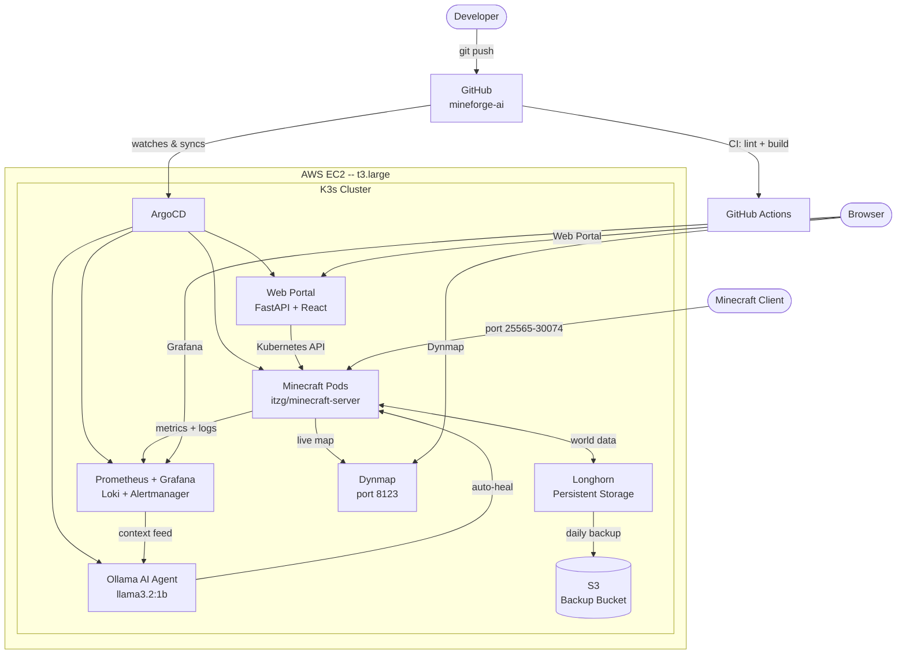

# MineForge AI

[](https://github.com/zachary-perlmutter/mineforge-ai/actions/workflows/ci.yaml)
[](LICENSE)

> Self-healing, multi-tenant Minecraft server platform on Kubernetes + AI

A DevOps portfolio project demonstrating end-to-end infrastructure automation: Terraform provisions EC2, Ansible configures K3s, ArgoCD manages GitOps deployments, Prometheus + Grafana + Dynmap provide observability, and an Ollama-powered AI agent detects and remediates failures autonomously.

---

## Live Demo

| Service | URL |
|---|---|
| Web Portal | CloudFront distribution (see `terraform output web_url`) |
| Grafana | `http://<NODE_IP>:30300` |
| ArgoCD | `http://<NODE_IP>:30080` |
| Dynmap | `http://<NODE_IP>:8123` |
| API docs | `http://<NODE_IP>:30090/docs` |

---

## Architecture



---

## Tech Stack

| Layer | Technology |
|---|---|
| Cloud | AWS EC2 (t3.large, us-east-1) |
| Kubernetes | K3s |
| IaC | Terraform |
| Config Management | Ansible |
| GitOps | ArgoCD |
| Storage | Longhorn |
| Backups | Longhorn snapshots to S3 (daily) |
| Monitoring | Prometheus + Grafana + Loki |
| Alerting | Alertmanager |
| Live Map | Dynmap |
| AI | Ollama (llama3.2:1b) |
| Frontend | FastAPI + React + Vite |
| Auth | Discord OAuth (optional) |
| CI/CD | GitHub Actions |

---

## Key Features

- **Dynamic provisioning** -- click "New Server" in the web portal; a Minecraft pod, NodePort service, and Longhorn PVC spin up in seconds
- **Self-healing** -- liveness probes detect crashes; Kubernetes restarts the pod automatically (measured: 73s recovery, 0 manual steps)
- **AI agent** -- Ollama watches logs and Prometheus metrics; on repeated crashes it diagnoses the cause and applies fixes (rollout restart, memory bump)
- **GitOps** -- every manifest lives in this repo; ArgoCD auto-syncs on push with auto-heal and prune
- **Observability** -- Grafana dashboard shows player count, CPU/RAM, pod restarts, and JVM heap; Loki aggregates MC logs
- **World backups** -- Longhorn snapshots to S3 hourly (local) and daily (remote); 7-day retention
- **Chaos engineering** -- scripted pod and node failure tests with timed recovery metrics

---

## Project Phases

| Phase | Description | Status |
|---|---|---|
| 1 | Planning + GitHub setup | Complete |
| 2 | K3s cluster on AWS EC2 (Terraform + Ansible) | Complete |
| 3 | Minecraft deployment with Longhorn persistent storage | Complete |
| 4 | Monitoring: Prometheus, Grafana, Loki, Dynmap | Complete |
| 5 | Terraform modules + remote state (S3 + DynamoDB) | Complete |
| 6 | Ansible playbooks: bootstrap, hardening, tuning | Complete |
| 7 | GitOps with ArgoCD | Complete |
| 8 | Self-healing: probes, HPA, AlertManager rules | Complete |
| 9 | AI layer: Ollama agent + auto-remediation | Complete |
| 10 | Web portal: FastAPI + React, CloudFront deploy | Complete |
| 11 | Chaos engineering, backups, CI/CD, Discord OAuth | Complete |

---

## Repository Structure

```
/
├── .github/
│   └── workflows/
│       ├── ci.yaml              # Lint + build on every PR
│       └── deploy-web.yaml      # Deploy React to S3/CloudFront on main push
├── terraform/                   # AWS EC2, VPC, S3, CloudFront, backup bucket
├── ansible/
│   └── playbooks/               # K3s bootstrap, hardening, Longhorn prereqs, JVM tuning
├── k8s/
│   ├── minecraft/               # Deployment, PVC, Service, HPA
│   ├── monitoring/              # Prometheus stack values, Loki, Grafana dashboard, Longhorn backup
│   ├── ollama/                  # Ollama deployment + PVC
│   ├── agent/                   # AI agent ConfigMap + Deployment
│   ├── api/                     # FastAPI ConfigMap, Deployment, Service, RBAC
│   └── argocd/                  # ArgoCD Application CRDs
├── app/
│   ├── api/                     # FastAPI source (mirrored to k8s/api/configmap.yaml)
│   └── web/                     # React + Vite frontend
├── scripts/
│   ├── chaos-pod.sh             # Delete MC pod, time recovery
│   └── chaos-node.sh            # Stop EC2 node, time full recovery
└── docs/
    ├── MineForge-AI-Master-Checklist.md
    └── MineForge-AI-Project-Plan.md
```

---

## Setup Guide

### Prerequisites

```bash
brew install kubectl terraform helm ansible awscli
curl -sLS https://get.k3sup.dev | sh

# Configure AWS profile
aws configure --profile mineforge
```

### 1. Terraform (AWS Infrastructure)

```bash
cd terraform
terraform init
terraform plan
terraform apply

# Save outputs for later steps
terraform output server_public_ip
terraform output web_url
terraform output longhorn_backup_access_key_id
terraform output longhorn_backup_secret_access_key   # sensitive
```

### 2. Ansible (K3s + System Config)

```bash
# Update inventory.ini with your EC2 IP, then:
cd ansible
ansible-playbook -i inventory.ini playbooks/bootstrap.yaml
ansible-playbook -i inventory.ini playbooks/harden.yaml
ansible-playbook -i inventory.ini playbooks/longhorn-prereqs.yaml
ansible-playbook -i inventory.ini playbooks/tuning.yaml
```

### 3. Kubeconfig

```bash
k3sup install \
  --ip $(terraform -chdir=terraform output -raw server_public_ip) \
  --user ubuntu \
  --ssh-key ~/.ssh/id_rsa \
  --skip-install

export KUBECONFIG=~/.kube/config
kubectl get nodes   # should show Ready
```

### 4. Helm Charts

```bash
# Longhorn
helm repo add longhorn https://charts.longhorn.io
helm install longhorn longhorn/longhorn -n longhorn-system --create-namespace

# Prometheus stack
helm repo add prometheus-community https://prometheus-community.github.io/helm-charts
helm install kube-prometheus-stack prometheus-community/kube-prometheus-stack \
  -n monitoring --create-namespace \
  -f k8s/monitoring/prometheus-stack-values.yaml

# Loki
helm repo add grafana https://grafana.github.io/helm-charts
helm install loki grafana/loki-stack -n monitoring -f k8s/monitoring/loki-values.yaml

# ArgoCD
helm repo add argo https://argoproj.github.io/argo-helm
helm install argocd argo/argo-cd -n argocd --create-namespace \
  -f k8s/argocd/argocd-values.yaml
```

### 5. GitOps (ArgoCD)

```bash
# Apply Application CRDs -- ArgoCD syncs the rest from this repo
kubectl apply -f k8s/argocd/
```

### 6. World Backups

Fill in `k8s/monitoring/longhorn-backup.yaml` with the Terraform outputs for the IAM key and bucket name, then:

```bash
kubectl apply -f k8s/monitoring/longhorn-backup.yaml
```

Longhorn snapshots every hour (local) and backs up to S3 daily at 04:00 UTC. 7-day retention.

### 7. Discord OAuth (Optional)

```bash
# Create app at https://discord.com/developers/applications
# Add redirect: https://<your-domain>/callback

cp k8s/api/discord-secret.yaml.example k8s/api/discord-secret.yaml
# Edit with your credentials, then:
kubectl apply -f k8s/api/discord-secret.yaml
kubectl rollout restart deployment/mineforge-api -n minecraft
```

### 8. GitHub Actions Secrets

In the repo settings under Secrets and Variables:

| Key | Value |
|---|---|
| `AWS_ACCESS_KEY_ID` | CI IAM user access key |
| `AWS_SECRET_ACCESS_KEY` | CI IAM user secret key |
| `vars.API_URL` | `http://<NODE_IP>:30090` |
| `vars.NODE_IP` | EC2 public IP |
| `vars.S3_BUCKET` | `mineforge-ai-web-<account_id>` |
| `vars.CLOUDFRONT_ID` | CloudFront distribution ID |

CI runs on every PR; frontend deploys automatically on push to `main` when `app/web/` changes.

---

## Chaos Engineering

```bash
# Test 1: pod deletion recovery
./scripts/chaos-pod.sh
# Measured: 73s from delete to Ready, 0 manual steps

# Test 2: EC2 node stop/start
./scripts/chaos-node.sh
# Requires AWS CLI with --profile mineforge
```

---

## Running Cost

| Resource | ~Cost/mo |
|---|---|
| t3.large EC2 | $24 |
| 40GB gp3 EBS | $3 |
| S3 (state + backups) | $1 |
| CloudFront | $1 |
| **Total** | **~$29** |

---

## License

[MIT](LICENSE)
