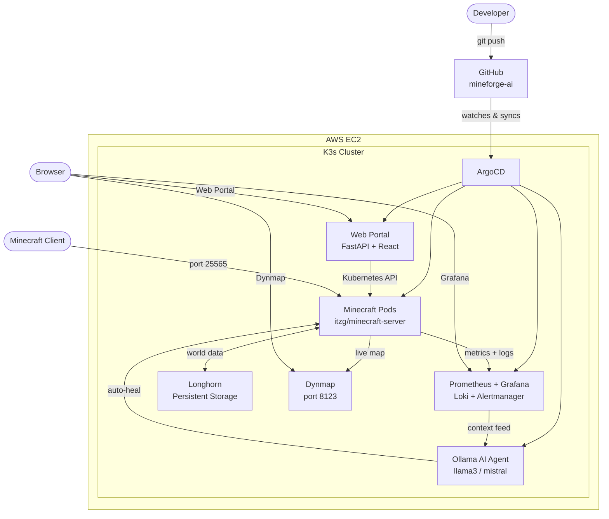

# MineForge AI

> Self-healing, multi-tenant Minecraft server platform on Kubernetes + AI

A DevOps portfolio project demonstrating end-to-end infrastructure automation: Terraform provisions EC2, Ansible configures K3s nodes, ArgoCD manages GitOps deployments, Prometheus + Grafana + Dynmap provide observability, and an Ollama-powered AI agent detects and remediates failures autonomously.

---

## Architecture



---

## Tech Stack

| Layer | Technology |
|---|---|
| Cloud | AWS EC2 |
| Kubernetes | K3s |
| IaC | Terraform |
| Config Management | Ansible |
| GitOps | ArgoCD |
| Storage | Longhorn |
| Monitoring | Prometheus + Grafana + Loki |
| Live Map | Dynmap |
| AI | Ollama (llama3 / mistral) |
| Frontend | FastAPI + React |

---

## Project Phases

| Phase | Description | Status |
|---|---|---|
| 1 | Planning & GitHub setup | In progress |
| 2 | K3s cluster on AWS EC2 (Terraform + Ansible) | Pending |
| 3 | Minecraft deployment with persistent storage | Pending |
| 4 | Monitoring: Prometheus, Grafana, Dynmap | Pending |
| 5 | Infrastructure as Code (full Terraform modules) | Pending |
| 6 | Configuration management (Ansible playbooks) | Pending |
| 7 | GitOps with ArgoCD | Pending |
| 8 | Self-healing and automation | Pending |
| 9 | AI layer: Ollama agent + auto-remediation | Pending |
| 10 | Web portal | Pending |
| 11 | Chaos engineering, polish, demo video | Pending |

---

## Repository Structure

```
/
├── terraform/     # AWS EC2, VPC, security groups, state backend
├── ansible/       # K3s bootstrap, hardening, system tuning
├── k8s/           # Kubernetes manifests (ArgoCD-managed)
├── app/           # Web portal backend + frontend
└── docs/          # Architecture diagrams, runbooks
```

---

## Running Cost

~$20-40/month on AWS using `t3.medium` EC2 instances. K3s is used instead of EKS to avoid managed control-plane costs.

---

## License

[MIT](LICENSE)
